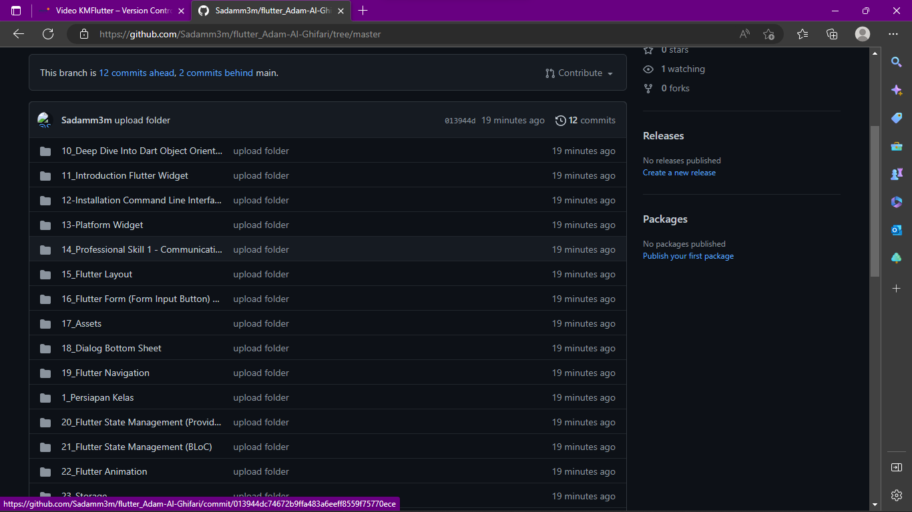

## Belajar Tentang Github
##### belajar membuat repositori di Github 

##### Upload folder di laptop dengan cara meremote GitHub 

#### Serta membuat branch dengan cara cli dengan membuat Branch Developer, FutureA, FutureB 
#### dan belajar Gunakan command command git seperti push, pull, merge dan stash dan banyal lagi

